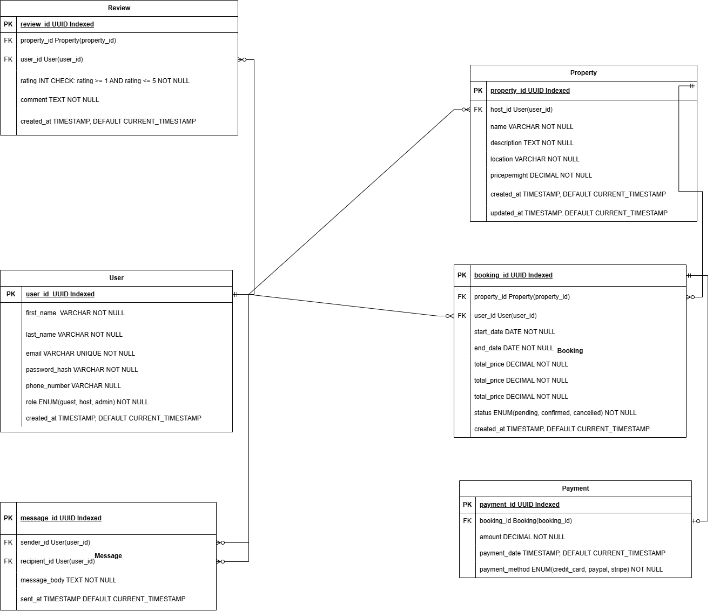

# Project Requirements

## Overview
This document outlines the key requirements for the database system, including the entities, attributes, relationships, and cardinality for the project. The design is based on the provided specifications and ensures clarity for implementation.

## Entities and Attributes
### 1. User
- `user_id` (Primary Key, UUID, Indexed)
- `first_name` (VARCHAR, NOT NULL)
- `last_name` (VARCHAR, NOT NULL)
- `email` (VARCHAR, UNIQUE, NOT NULL)
- `password_hash` (VARCHAR, NOT NULL)
- `phone_number` (VARCHAR, NULL)
- `role` (ENUM: guest, host, admin, NOT NULL)
- `created_at` (TIMESTAMP, DEFAULT CURRENT_TIMESTAMP)

### 2. Property
- `property_id` (Primary Key, UUID, Indexed)
- `host_id` (Foreign Key: User(user_id))
- `name` (VARCHAR, NOT NULL)
- `description` (TEXT, NOT NULL)
- `location` (VARCHAR, NOT NULL)
- `pricepernight` (DECIMAL, NOT NULL)
- `created_at` (TIMESTAMP, DEFAULT CURRENT_TIMESTAMP)
- `updated_at` (TIMESTAMP, ON UPDATE CURRENT_TIMESTAMP)

### 3. Booking
- `booking_id` (Primary Key, UUID, Indexed)
- `property_id` (Foreign Key: Property(property_id))
- `user_id` (Foreign Key: User(user_id))
- `start_date` (DATE, NOT NULL)
- `end_date` (DATE, NOT NULL)
- `total_price` (DECIMAL, NOT NULL)
- `status` (ENUM: pending, confirmed, canceled, NOT NULL)
- `created_at` (TIMESTAMP, DEFAULT CURRENT_TIMESTAMP)

### 4. Payment
- `payment_id` (Primary Key, UUID, Indexed)
- `booking_id` (Foreign Key: Booking(booking_id))
- `amount` (DECIMAL, NOT NULL)
- `payment_date` (TIMESTAMP, DEFAULT CURRENT_TIMESTAMP)
- `payment_method` (ENUM: credit_card, paypal, stripe, NOT NULL)

### 5. Review
- `review_id` (Primary Key, UUID, Indexed)
- `property_id` (Foreign Key: Property(property_id))
- `user_id` (Foreign Key: User(user_id))
- `rating` (INTEGER: 1-5, NOT NULL)
- `comment` (TEXT, NOT NULL)
- `created_at` (TIMESTAMP, DEFAULT CURRENT_TIMESTAMP)

### 6. Message
- `message_id` (Primary Key, UUID, Indexed)
- `sender_id` (Foreign Key: User(user_id))
- `recipient_id` (Foreign Key: User(user_id))
- `message_body` (TEXT, NOT NULL)
- `sent_at` (TIMESTAMP, DEFAULT CURRENT_TIMESTAMP)

## Relationships
### Key Relationships and Cardinality:
1. **User ↔ Booking**: One user can have multiple bookings. (1:N)
2. **Property ↔ Booking**: One property can have multiple bookings. (1:N)
3. **User ↔ Review**: One user can leave multiple reviews. (1:N)
4. **Property ↔ Review**: One property can have multiple reviews. (1:N)
5. **Booking ↔ Payment**: One booking can have one or more payments. (1:N)
6. **User ↔ Message**: One user can send multiple messages. (1:N)

### Mandatory vs. Optional:
- **Booking** is optional for **User** (a user may not book).
- **Review** is optional for **User** and **Property**.
- **Payment** is mandatory for **Booking**.
- **Message** is optional for **User**.

## ER Diagram
The Entity-Relationship Diagram (ERD) is shown below:

